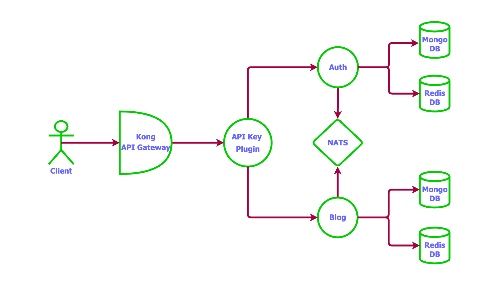

## Create Blogging Platform Microservices

This project creates a blogging API service using [Nest](https://github.com/nestjs/nest) framework. In this project will be using Kong is used as the API gateway. Each service will have its own Mongo database and Redis database .

## Inspiration

This project breaks down the monolithic go blog backend project provided at [goserve](https://github.com/unusualcodeorg/goserve) repository. It uses the [goserve](https://github.com/unusualcodeorg/goserve) REST API framework to build the auth_service, and blog_service.

### Highlights

- NestJS microservice architecture
- kong API gateway (Future Scope)
- nats for microservices communication (Future Scope)
- custom kong go plugin for apikey validation (Future Scope)
- docker and docker-compose
- mongo
- redis (Future Scope)
- authorization => role based authorization to be added
- Added refresh tokens for better user experience 

### Project Directories

1. **auth_service**: auth APIs code
2. **blog_service**: blog APIs code

## Microservice System Design

**Authentication**

- users collection exists in the auth_service database
- auth_service has logic to validate the JWT access token
- auth_service validates the token using a middleware
- blog_service asks auth_service to validate the token via Axios messaging

**Authorization**

- users and roles collection exists in the auth_service database (Future Scope)
- auth_service checks the roles based on the asked role code (Future Scope)
- auth_service validates the role using a middleware (Future Scope)
- blog_service asks auth_service to validate a user's role via Axios messaging (Future Scope)



## Description

[Nest](https://github.com/nestjs/nest) framework TypeScript starter repository.

## Installation

```bash
$ npm install
```

## Running the app

```bash
# development
$ npm run start

# watch mode
$ npm run start:dev

# production mode
$ npm run start:prod
```

## Support

Nest is an MIT-licensed open source project. It can grow thanks to the sponsors and support by the amazing backers. If you'd like to join them, please [read more here](https://docs.nestjs.com/support).

## Stay in touch

- ME - [Shrey Gupta](https://www.linkedin.com/in/shrey-gupta-11a350196/)
- LeetCode - [https://leetcode.com/u/guptashrey163/](https://leetcode.com/u/guptashrey163/)
- Gmail - [GMAIL](guptashrey163@gmail.com)
